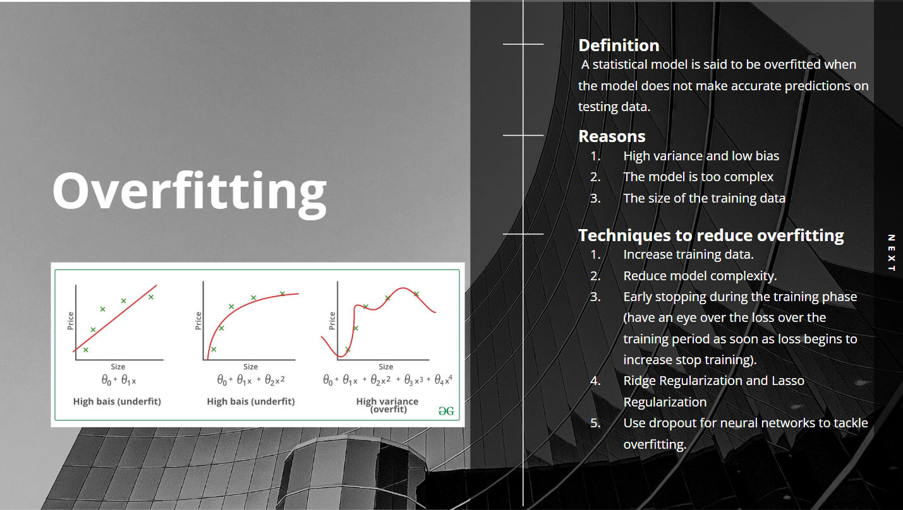
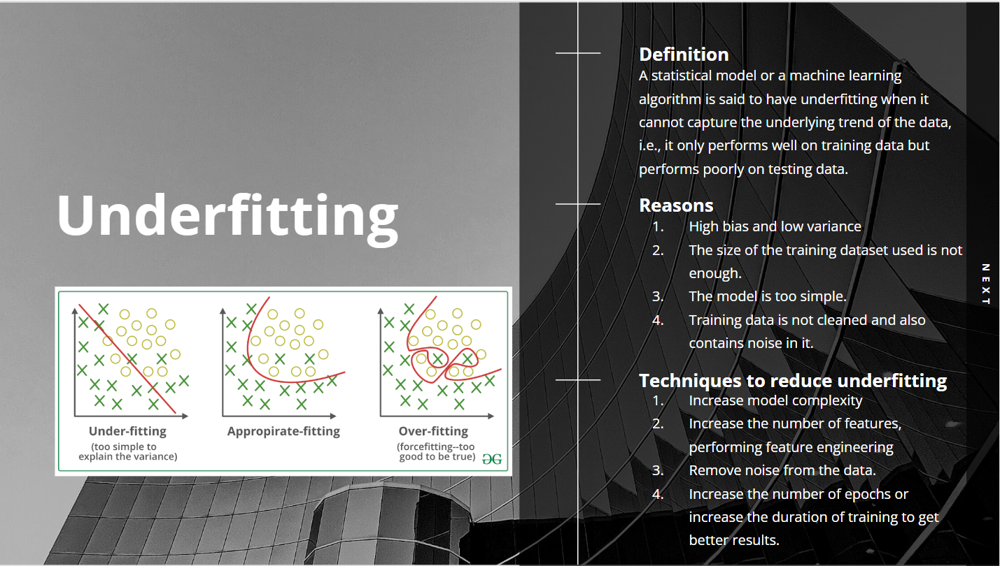
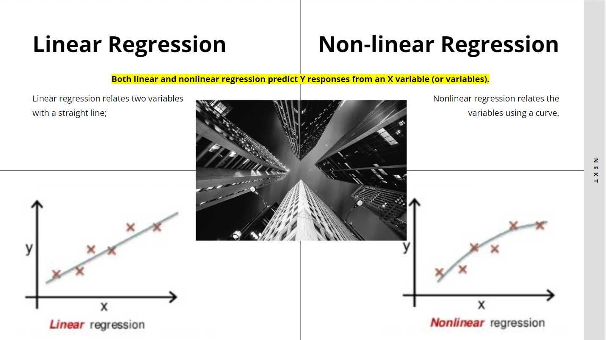
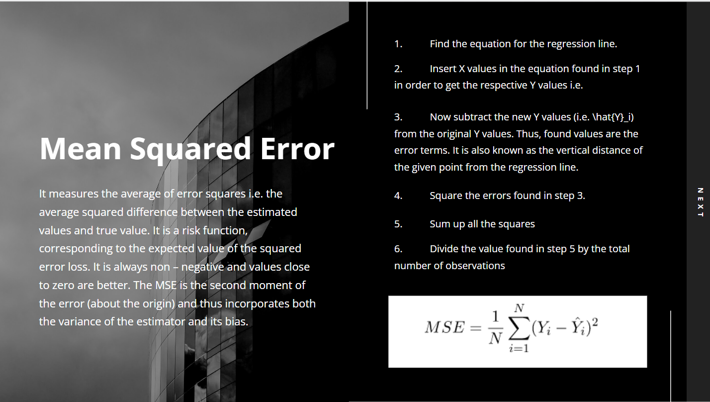
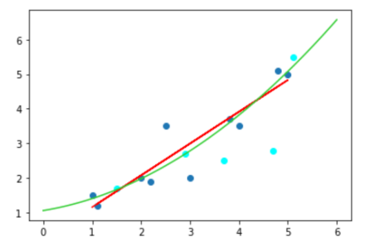

# Use Overfitting To Evaluate Different Models 

## Google Slide
[Machine Learning Model Selection Overfitting](https://docs.google.com/presentation/d/1oRTwh54K7QsZ-z5fYvRjTz21NDB7mZ_mxdL08l1C-_g/edit?usp=sharing)

## Introduction
### Overfitting and Underfitting



### Linear and Non-Linear Regression



### Mean Square Error (MSE)


## Design
* ### **Data**
  50% for training phase, 25% for validation phase and 25% for testing phase.


* ### **Get Models -- Training Phase**
  Using data for training set, get two models:
  *Linear Regression: 
      y = a + b * x
  *Non-Learner Regression: 
      y = a + b * x^2


* ### **Select Models -- Validation Phase**
  Using the two models get in training phase and calculate MSE and compare Models and select. 


* ### **Predict -- Testing Pase**
  Get the y values for data in Testing phase using the model selected previously.


## Implementation
[Detailed Steps](https://github.com/SharonCao0920/MachineLearning/blob/main/ModelSelection/UseOverfittingToEvaluateDifferentModels/DetailedSteps.pdf)

**Model 1:**	

y = 0.238803 + 0.918775x

**Model 2:** 	

y = 1.349341 + 0.151809 x^2

## Test
[Codes are uploaded](https://github.com/SharonCao0920/MachineLearning/blob/main/ModelSelection/UseOverfittingToEvaluateDifferentModels/CS550_ML_Model_Selection.ipynb)


## Enhancement Ideas
Plot all in one graph!
```
# Enhansement
# Plot the dots and graph the models
import matplotlib.pyplot as plt
from sklearn.linear_model import LinearRegression

# plot the data points
plt.scatter(x, y)
plt.scatter(x_v, y_v, color='aqua')

# plot the regression line
plt.plot( x, model1.predict(x), color='red')

x_fit = np.linspace(0, 6, 100)
y_fit = model2.predict(poly.fit_transform(x_fit.reshape(-1, 1)))
plt.plot(x_fit, y_fit, '-r', color='limegreen')

plt.show()
```



## Conclusion
With the evaluation using overfitting concept, Linear Regression model is slightly better than the Non-Linear Regression model.
The less sensitive the model act when adding new data, the better. 


## References
https://www.geeksforgeeks.org/underfitting-and-overfitting-in-machine-learning/ 

https://www.investopedia.com/terms/n/nonlinear-regression.asp#:~:text=Linear%20regression%20relates%20two%20variables%20with%20a%20straight%20line%3B%20nonlinear,the%20variables%20using%20a%20curve. 
