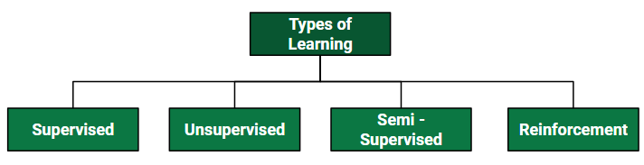
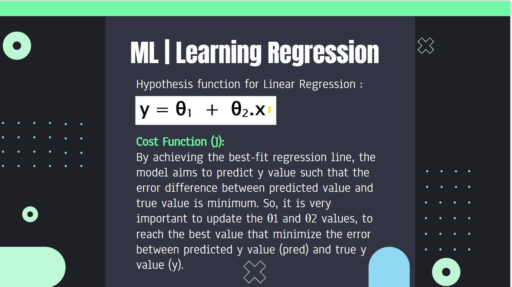
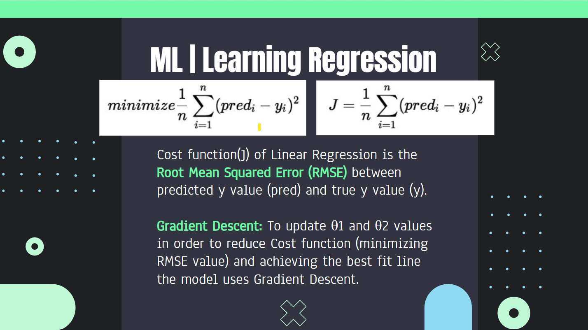
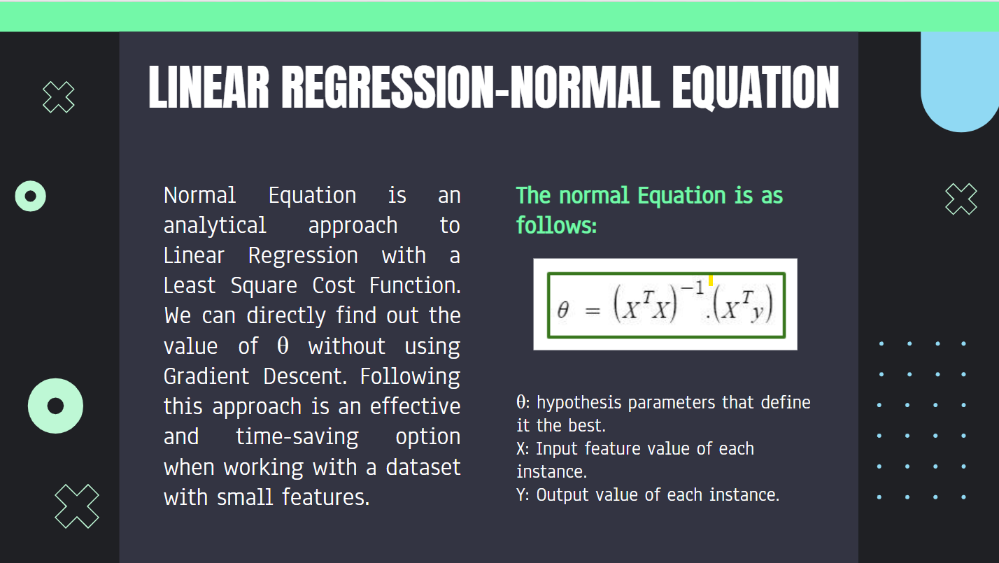
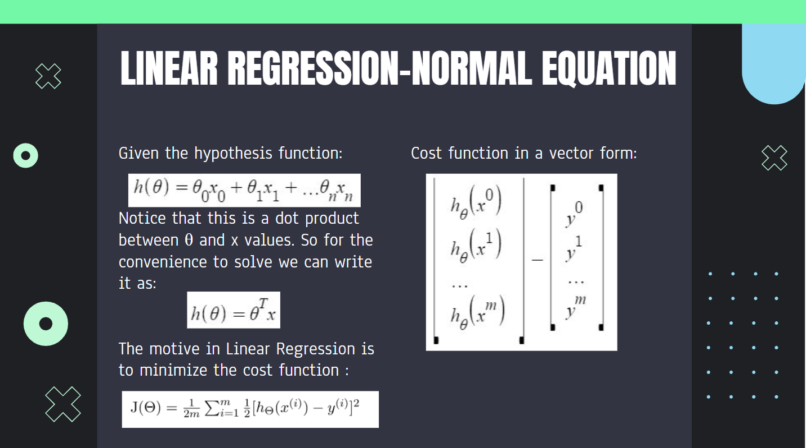
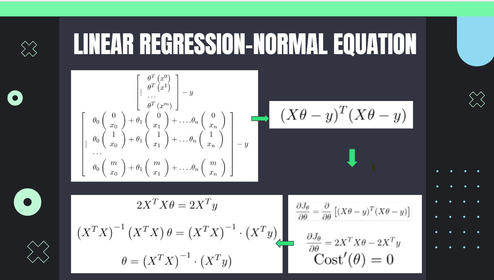
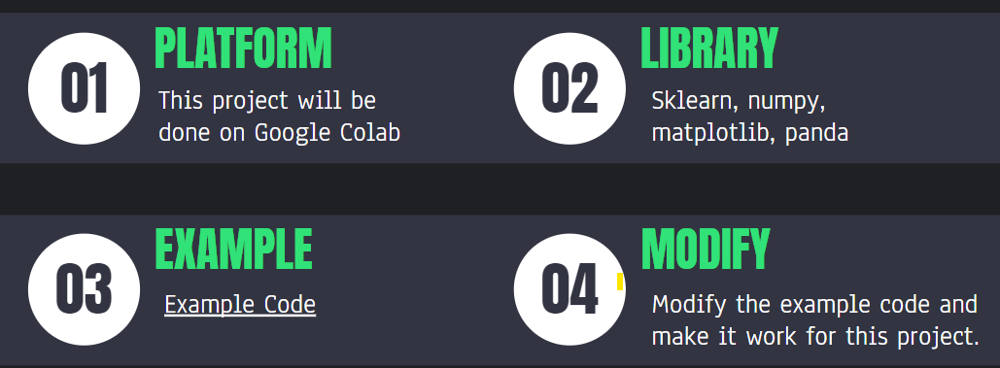

# Linear Regression using Normal Equation
[Geting Started with Colab](https://github.com/SharonCao0920/MachineLearning/tree/main/StartWithColab)

[Google Slides for This Project](https://docs.google.com/presentation/d/1kzSLvFwPWFy-T2dibN-3C-sF5qfO-mwLGCgpzsi9uZs/edit?usp=sharing)

## Introduction 
### Machine Learning Types


### Supervised Learning
**A. Classification:**
It is a Supervised Learning task where output is having defined labels(discrete value). The goal here is to predict discrete values belonging to a particular class and evaluate them on the basis of accuracy. 

**B. Regression:**
It is a Supervised Learning task where output is having continuous value. The goal here is to predict a value as much closer to the actual output value as our model can and then evaluation is done by calculating the error value. The smaller the error the greater the accuracy of our regression model.

**Example of Supervised Learning Algorithms:**
* Linear Regression
* Logistic Regression
* Nearest Neighbor
* Gaussian Naive Bayes
* Decision Trees
* Support Vector Machine (SVM)
* Random Forest

### Linear Regression with Normal Equation
Linear Regression is a machine learning algorithm based on supervised learning. It performs a regression task. Regression models a target prediction value based on independent variables. It is mostly used for finding out the relationship between variables and forecasting.







## Design


## Implementation
Code Modified
```
import numpy as np
import pandas as pd

# X = 2 * np.random.rand(100, 1)
# y = 4 + 3 * X + np.random.randn(100, 1)
from google.colab import files
uploaded  = files.upload()

import io
abalone = pd.read_csv(
    io.BytesIO(uploaded['abalone_train.csv']),
    names=["Length", "Diameter", "Height", "Whole weight", "Shucked weight",
           "Viscera weight", "Shell weight", "Age"])
# X1 is 
#    0       0.435
#    1       0.585
#    2       0.655
#    .....
X1 = abalone["Length"]

# X2 is 
#    array([0.435, 0.585, ...., 0.45])
X2 = np.array(X1)

# X is 
#    array([[0.435],
#           [0.585],
#           [0.655],
#           ...,A
#           [0.53 ],
#           [0.395],
#           [0.45 ]])
X = X2.reshape(-1, 1)

y1 = abalone["Height"]
y2 = np.array(y1)
y = y2.reshape(len(y2), 1)
```

## Test
[Testing Result can be found in details in File](https://github.com/SharonCao0920/MachineLearning/blob/main/SupervisedLearning/LinearRegressionusingNormalEquation/CS550_Week2_HW2_Yixin_Cao_19536.ipynb)

## Conclusion
Python is very capable for training large dataset with its libraries. And it is easy to understand and use in practice. 

## Enhancement
There are also other ways to link to data, for example upload from the Google Drive or link the data from online resources.

To verify the Normal Equation, we can also use for example the sklearn library to get the linear regression formula and compare the result with the one from Normal Equation.


## References
https://www.geeksforgeeks.org/ml-types-learning-supervised-learning/ 
https://www.geeksforgeeks.org/ml-types-learning-part-2/?ref=lbp 
https://www.geeksforgeeks.org/ml-semi-supervised-learning/ 
https://www.geeksforgeeks.org/what-is-reinforcement-learning/ 
https://www.geeksforgeeks.org/ml-linear-regression/ 
https://www.geeksforgeeks.org/ml-normal-equation-in-linear-regression/

